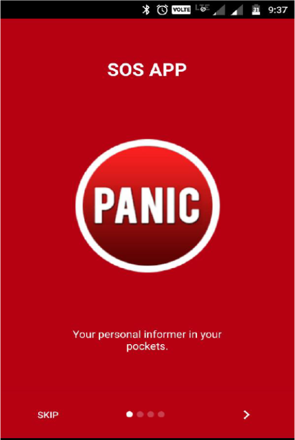
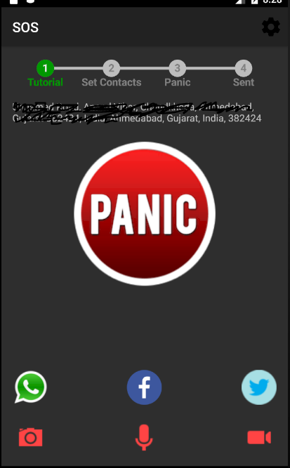
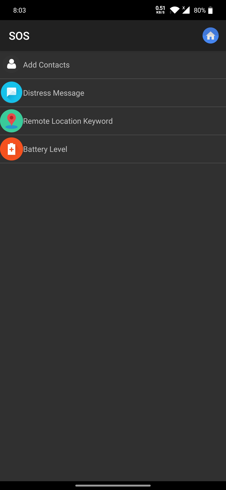
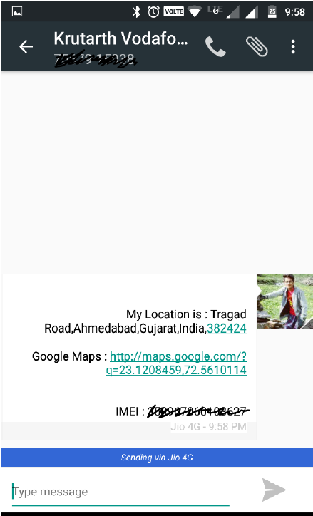

# SOS-Panic-App
The application lets the users send distress messages (along with the user's current location and the IMEI number) to specified contact via SMS, and/or posts in social networking platforms such as WhatsApp and Facebook.
The contacts specifed by users can access the location of the users (if allowed by the user) by sending a remote location keyword to the user. The application detects the message and checks if it is the remote location keyword as specified by the user. If it is, the application sends the current location of the user to the one who requested it.

Note: Some screenshots may be old because of the updates in the application, but overall the features remain the same.

**Introduction Screen**

**Homescreen**

**Settings Screen**

**Specify custom message**

**Specify remote location keyword**

**Message**

